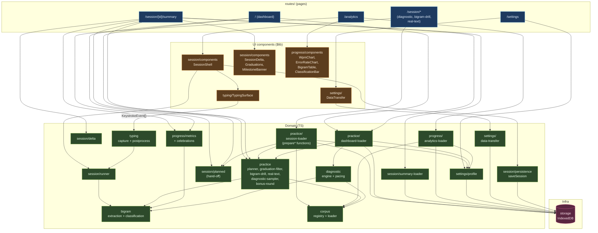

# Architecture

High-level schema of how the `src/lib` modules interact. Each route is itself a
Svelte page; the **UI layer** below shows only reusable components imported from
`$lib`.

Routes import only UI components and domain modules — they never reach into
`storage/*` directly. Persistence is mediated by the domain (`settings/profile`,
`settings/data-transfer`, `session/persistence`, the loaders, etc.).

## Main flows

- **Dashboard (`/`)** — calls `practice/dashboard-loader` which fetches recent sessions, runs the planner, and returns the next planned session(s). `session/planned` handles hand-off on "Start".
- **Session write-path (`/session/*`)** — route calls a `practice/session-loader` (`prepareBigramDrillSession` / `prepareRealTextSession` / `prepareDiagnosticSession`) to get ready-to-render text + metadata. `SessionShell` → `TypingSurface` captures raw keystrokes → `typing/postprocess` annotates → `session/runner` aggregates (delegating bigram math to `bigram/extraction`) → `SessionSummary` persisted via `session/persistence`.
- **Summary (`/session/[id]/summary`)** — `session/summary-loader` fetches the session + recent history in one shot. Route then composes `session/delta`, `progress/celebrations`, and a `practice/dashboard-loader` call (sharing the same `recentSessions`) to show "what's next".
- **Analytics (`/analytics`)** — `progress/analytics-loader` returns sessions + profile + corpus frequencies; `progress/metrics` turns them into trend series and the charts render them.
- **Settings (`/settings`)** — reads/writes `settings/profile`; delegates export/import UI to `DataTransfer`, which talks to `settings/data-transfer`.

## Module purposes

| Module       | Role                                                                                                                                                                   |
| ------------ | ---------------------------------------------------------------------------------------------------------------------------------------------------------------------- |
| `typing`     | Keystroke capture attachment, `KeystrokeEvent` types, postprocess annotation.                                                                                          |
| `session`    | `SessionRunner`, `SessionSummary` construction, delta computation, `saveSession`, route hand-off, summary loader, UI components.                                       |
| `bigram`     | Classification (+ thresholds), extraction, accuracy/timing aggregation from events.                                                                                    |
| `diagnostic` | Weakness-report engine and pacing computation. Practice-side sampling lives in `practice`.                                                                             |
| `practice`   | What-to-practice-next domain: drill/real-text/diagnostic text generation, planner, graduation filter, bonus round, plus the dashboard and session loaders routes call. |
| `corpus`     | Text corpus registry, loading, normalization, custom texts.                                                                                                            |
| `progress`   | Metrics computation, celebrations logic, analytics chart components, analytics loader.                                                                                 |
| `storage`    | IndexedDB Dexie instance + low-level helpers. Only domain modules call into it; UI goes through the domain.                                                            |
| `stores`     | Theme UI state.                                                                                                                                                        |
| `components` | Shared UI (theme selector).                                                                                                                                            |
| `settings`   | User-profile domain (`profile`), export/import domain (`data-transfer`), `DataTransfer` component.                                                                     |
