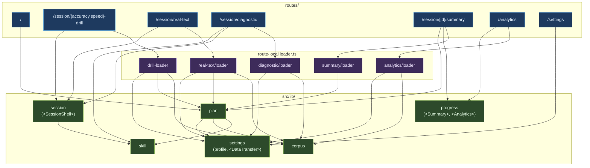

# Architecture

High-level schema of how `src/lib` is organized. Six **domains** sit on top of
two **support layers**; routes compose domains through a thin route-local
`loader.ts`.

## Principles

1. **One public surface per domain.** Ideally a single function or a single
   Svelte component. Accept two only when the consumers are genuinely distinct.
2. **Domains don't orchestrate — routes do.** Page composition (fetch this,
   compute that, pass to component) lives in `loader.ts` next to each route.
   Domains are pure logic + components; they don't import each other through
   orchestration helpers.
3. **Lib-boundary rule.** Imports must go through a lib barrel (`$lib/corpus`,
   `$lib/support/core`). Deep paths into internals are banned by ESLint. The
   only exceptions are `.svelte` components and `$lib/assets/**`.
4. **UI must not touch storage directly.** Routes (`+page.svelte`) can't import
   `$lib/support/storage`; route-local `loader.ts` files are the orchestration
   layer and are the only place that may.

## Domains

| Domain       | Responsibility                                          | Public surface                        |
| ------------ | ------------------------------------------------------- | ------------------------------------- |
| **Corpus**   | Produces the text the user will type.                   | `generateText`, registry loaders      |
| **Plan**     | Resolves "what should the user do next?".               | `computePlan`, `resolveDrillMix`      |
| **Session**  | Runs the live typing loop and saves the result.         | `<SessionShell>`                      |
| **Skill**    | Measures how well the user types each bigram.           | `extractBigramAggregates`, assessment |
| **Progress** | Turns session history into views for the user.          | `
`, `<Analytics>`            |
| **Settings** | Reads and writes the user profile; makes data portable. | `profile`, `<DataTransfer>`           |

## Support layers (not domains)

- **`support/core`** — Shared types (`SessionSummary`, `BigramAggregate`,
  `KeystrokeEvent`, `UserSettings`, thresholds, …). Type-only; no runtime; no
  `$lib/*` imports. The DAG leaf.
- **`support/storage`** — Dexie wrapper. Only domains and route-local loaders
  touch it; UI never does.
- **`support/theme`** — Theme selector component + store.

## Dependency graph

## Main flows

- **Dashboard (`/`)** — calls `computePlan` directly (no loader; the dashboard
  is just a thin view over the plan). `startPlannedSession` / `startFreshPlan`
  from `$lib/plan` handle the hand-off to session routes.
- **Drill sessions (`/session/{accuracy,speed}-drill`)** — shared
  `routes/session/drill-loader.ts` consumes any planned hand-off, resolves a
  drill mix via `plan`, generates text via `corpus`, and returns a ready-to-render
  config. `<SessionShell>` captures keystrokes, aggregates via `skill`, persists
  via `session/persistence`.
- **Real-text / diagnostic sessions** — their own `loader.ts` files call into
  `corpus.generateText` with the right spec; the rest mirrors the drill flow.
- **Summary (`/session/[id]/summary`)** — `summary/loader` fetches the session +
  recent history, re-runs `computePlan` for the "Next session" CTA, and returns
  one view-model. The route renders `
` and wires the hand-off actions.
- **Analytics (`/analytics`)** — `analytics/loader` returns sessions, profile,
  and corpus frequencies; `<Analytics>` renders the charts.
- **Settings (`/settings`)** — reads/writes via `$lib/settings.profile`;
  delegates export/import UI to `<DataTransfer>`.

## Testing

Each domain has **one test file per public entry point** (R5 in the now-retired
reshape plan). Logic domains (`corpus`, `plan`, `skill`) are exercised through
their public functions; component domains (`session`, `progress`, settings'
`<DataTransfer>`) lean on the `e2e/` Playwright suite as the outermost frontier.
`settings/profile.test.ts` is kept because `profile` is a public surface.

A test-only helper at `$lib/test-utils/fixtures.ts` lets tests seed state
without exposing domain internals on the production surface.
