# Architecture

High-level schema of how the `src/lib` modules interact. Each route is itself a
Svelte page; the **UI layer** below shows only reusable components imported from
`$lib`.

Routes talk to **one loader per page** plus the components they render —
loaders are the single route→domain boundary. Routes never import
`storage/*`, `progress/delta`, `progress/celebrations`, or domain sub-modules
directly; each loader composes the pieces its page needs and returns a
ready-to-render view-model. Persistence is mediated by the domain
(`settings/profile`, `settings/data-transfer`, `session/persistence`, the
loaders).

```mermaid
flowchart TB
    subgraph Routes["routes/"]
        R_Dash["/"]
        R_Sess["/session/*"]
        R_Summ["/session/[id]/summary"]
        R_Ana["/analytics"]
        R_Set["/settings"]
    end

    subgraph Practice["practice/"]
        P_DashL["dashboard-loader<br/>(hand-off actions)"]
        P_SessL["session-loader"]
        P_Plan["plan (computePlan)"]
        P_Planner["planner"]
        P_PlanWin["plan-window"]
        P_Planned["planned"]
        P_Grad["graduation-filter"]
        P_Drill["bigram-drill"]
        P_Real["real-text"]
        P_DiagS["diagnostic-sampler"]
    end

    subgraph Session["session/"]
        S_Runner["runner"]
        S_Persist["persistence"]
        S_Pacer["pacer"]
        S_Comp["components<br/>(SessionShell, …)"]
    end

    subgraph Progress["progress/"]
        Pr_AnaL["analytics-loader"]
        Pr_SummL["summary-loader"]
        Pr_Metrics["metrics"]
        Pr_Delta["delta"]
        Pr_Celeb["celebrations"]
        Pr_Comp["components<br/>(charts, SessionDelta,<br/>Graduations, MilestoneBanner)"]
    end

    subgraph Settings["settings/"]
        St_Profile["profile"]
        St_DT["data-transfer"]
        St_DTUI["DataTransfer.svelte"]
    end

    subgraph Diagnostic["diagnostic/"]
        D_Engine["engine"]
        D_Pacing["pacing"]
    end

    subgraph Bigram["bigram/"]
        B_Class["classification"]
        B_Extr["extraction"]
    end

    subgraph Typing["typing/"]
        T_Capture["capture"]
        T_Post["postprocess"]
        T_UI["TypingSurface<br/>TextDisplay"]
    end

    Corpus["corpus"]
    Core["core (types)"]
    Stores["stores"]
    Components["components"]
    Storage[("storage<br/>IndexedDB")]

    %% Route → loader (one entry per page). Routes never touch storage.
    R_Dash --> P_DashL
    R_Sess --> P_SessL
    R_Sess --> S_Comp
    R_Summ --> Pr_SummL
    R_Summ --> Pr_Comp
    R_Ana --> Pr_AnaL
    R_Ana --> Pr_Comp
    R_Set --> St_Profile
    R_Set --> St_DTUI
    R_Dash --> Components
    R_Dash --> Stores

    %% practice/dashboard-loader delegates to computePlan; adds hand-off actions.
    P_DashL --> P_Plan
    P_DashL --> P_Planned
    P_DashL --> P_PlanWin

    %% practice/plan — shared plan-computation pipeline.
    P_Plan --> St_Profile
    P_Plan --> Storage
    P_Plan --> Pr_Metrics
    P_Plan --> Corpus
    P_Plan --> P_Grad
    P_Plan --> P_Planner
    P_Plan --> P_PlanWin

    %% practice/session-loader composes the session-start view-model.
    P_SessL --> Storage
    P_SessL --> Pr_Metrics
    P_SessL --> P_Planned
    P_SessL --> P_Drill
    P_SessL --> P_Real
    P_SessL --> P_DiagS
    P_SessL --> P_Grad
    P_SessL --> P_Planner

    %% progress/summary-loader reuses computePlan for the "Next session" CTA.
    %% This is the one place progress depends on practice — deliberate, since
    %% the summary page owns the "what's next" handoff and we want one loader
    %% composing everything the route renders.
    Pr_SummL --> Storage
    Pr_SummL --> Pr_Delta
    Pr_SummL --> P_Plan
    Pr_SummL --> Pr_Celeb

    %% progress/analytics-loader.
    Pr_AnaL --> Storage
    Pr_AnaL --> St_Profile
    Pr_AnaL --> Corpus
    Pr_AnaL --> Pr_Metrics

    %% settings internals.
    St_Profile --> Storage
    St_Profile --> B_Class
    St_DT --> Storage
    St_DTUI --> St_DT

    %% Session runtime (session/*). SessionShell wires capture → runner → persistence.
    S_Comp --> T_UI
    S_Comp --> S_Runner
    S_Comp --> S_Pacer
    S_Comp --> S_Persist
    T_UI --> T_Capture
    S_Runner --> T_Post
    S_Runner --> B_Extr
    S_Persist --> Storage
    Pr_Delta --> B_Class
    Pr_Delta --> Pr_Metrics

    %% practice internals.
    P_Drill --> Corpus
    P_DiagS --> Corpus
    P_DiagS --> P_Real

    %% progress internals.
    Pr_Celeb --> Pr_Metrics
    Pr_Metrics --> Corpus

    %% bigram / diagnostic / typing internals.
    B_Extr --> B_Class
    B_Extr --> T_Post
    D_Engine --> T_Post
    D_Engine --> D_Pacing

    Components --> Stores
    Storage --> Core

    classDef route fill:#1e3a5f,stroke:#5aa9e6,color:#e6f2ff
    classDef loader fill:#3d2b5a,stroke:#a78bfa,color:#f0e6ff
    classDef domain fill:#2d4a2b,stroke:#7cb342,color:#eaffea
    classDef support fill:#5c3d1e,stroke:#e89f4c,color:#fff2e0
    classDef infra fill:#5a2740,stroke:#e06c9f,color:#ffe6f0

    class R_Dash,R_Sess,R_Summ,R_Ana,R_Set route
    class P_DashL,P_SessL,Pr_SummL,Pr_AnaL loader
    class P_Plan,P_Planner,P_PlanWin,P_Planned,P_Grad,P_Drill,P_Real,P_DiagS,S_Runner,S_Persist,S_Pacer,S_Comp,Pr_Metrics,Pr_Delta,Pr_Celeb,Pr_Comp,St_Profile,St_DT,St_DTUI,D_Engine,D_Pacing,B_Class,B_Extr,T_Capture,T_Post,T_UI,Corpus,Core domain
    class Stores,Components support
    class Storage infra
```

## Main flows

- **Dashboard (`/`)** — calls `practice/dashboard-loader` (thin wrapper over `practice/plan.computePlan`) which fetches recent sessions, runs the planner, and returns the next planned session(s). The loader also exposes `startPlannedSession` / `startFreshPlan` so the route doesn't touch `sessionStorage` or `window.location` directly.
- **Session write-path (`/session/*`)** — route calls a `practice/session-loader` (`prepareBigramDrillSession` / `prepareRealTextSession` / `prepareDiagnosticSession`) to get ready-to-render text + metadata. The loader consumes any `practice/planned` hand-off stashed by the dashboard. `SessionShell` → `TypingSurface` captures raw keystrokes → `typing/postprocess` annotates → `session/runner` aggregates (delegating bigram math to `bigram/extraction`) → `SessionSummary` persisted via `session/persistence`.
- **Summary (`/session/[id]/summary`)** — `progress/summary-loader` fetches the session + recent history, runs `progress/delta`, `progress/celebrations`, and a shared `practice/plan.computePlan` call (reusing the same `recentSessions`) for the "Next session" CTA, and returns one view-model. The route is render-only plus the `startPlannedSession` / `startFreshPlan` hand-off actions.
- **Analytics (`/analytics`)** — `progress/analytics-loader` returns sessions + profile + corpus frequencies + pre-computed trend series (via `progress/metrics`), and the charts render them.
- **Settings (`/settings`)** — reads/writes `settings/profile`; delegates export/import UI to `DataTransfer`, which talks to `settings/data-transfer`.

## Module purposes

| Module       | Role                                                                                                                                                                                                                                                            |
| ------------ | --------------------------------------------------------------------------------------------------------------------------------------------------------------------------------------------------------------------------------------------------------------- |
| `typing`     | Keystroke capture attachment, `KeystrokeEvent` types, postprocess annotation.                                                                                                                                                                                   |
| `session`    | `SessionRunner`, `SessionSummary` construction, `saveSession`, session-runtime UI components.                                                                                                                                                                   |
| `bigram`     | Classification (+ thresholds), extraction, accuracy/timing aggregation from events.                                                                                                                                                                             |
| `diagnostic` | Weakness-report engine and pacing computation. Practice-side sampling lives in `practice`.                                                                                                                                                                      |
| `practice`   | What-to-practice-next domain: drill/real-text/diagnostic text generation, planner, graduation filter, bonus round, route hand-off (`planned`), the shared plan-compute pipeline (`plan.computePlan`), plus the dashboard and session loaders routes call.       |
| `corpus`     | Text corpus registry, loading, normalization.                                                                                                                                                                                                                   |
| `progress`   | Metrics computation, session-delta (prior-vs-current comparison), celebrations logic, analytics + summary-page loaders, analytics + delta chart components.                                                                                                     |
| `storage`    | IndexedDB Dexie instance + low-level helpers. Only domain modules call into it; UI goes through the domain.                                                                                                                                                     |
| `stores`     | Theme UI state.                                                                                                                                                                                                                                                 |
| `components` | Shared UI (theme selector).                                                                                                                                                                                                                                     |
| `settings`   | User-profile domain (`profile`), export/import domain (`data-transfer`), `DataTransfer` component.                                                                                                                                                              |
| `core`       | Shared domain types (`SessionSummary`, `SessionType`, `SessionConfig`, `UserSettings`, `Language`, `BigramAggregate`, `BigramClassification`, `BigramSample`, `DiagnosticReport`, `PriorityBigram`). Type-only; no runtime, no `$lib/*` imports — the DAG leaf. |
