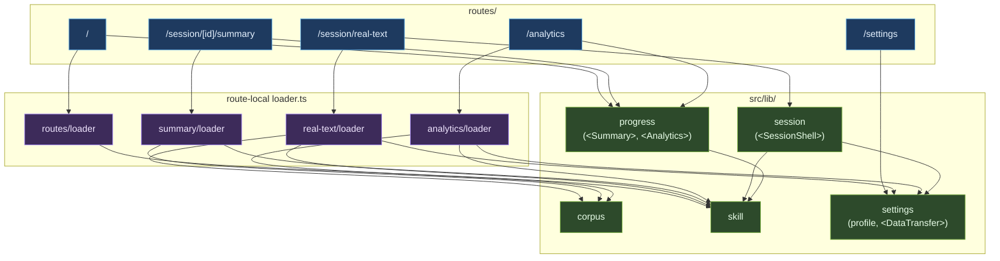

# Architecture

High-level schema of how `src/lib` is organized. Six **domains** sit on top of
two **support layers**; routes compose domains through a thin route-local
`loader.ts`.

## Principles

1. **One public surface per domain.** Ideally a single function or a single
   Svelte component. Accept two only when the consumers are genuinely distinct.
2. **Domains don't orchestrate — routes do.** Page composition (fetch this,
   compute that, pass to component) lives in `loader.ts` next to each route.
   Domains are pure logic + components; they don't import each other through
   orchestration helpers.
3. **Lib-boundary rule.** Imports must go through a lib barrel (`$lib/corpus`,
   `$lib/support/core`). Deep paths into internals are banned by ESLint. The
   only exceptions are `.svelte` components and `$lib/assets/**`.
4. **UI must not touch storage directly.** Routes (`+page.svelte`) can't import
   `$lib/support/storage`; route-local `loader.ts` files are the orchestration
   layer and are the only place that may.

## Domains

| Domain       | Responsibility                                          | Public surface                     |
| ------------ | ------------------------------------------------------- | ---------------------------------- |
| **Corpus**   | Produces or selects the text the user will type.        | `generateText`, `scoreQuoteByDebt` |
| **Session**  | Runs the live typing loop and saves the result.         | `<SessionShell>`                   |
| **Skill**    | Measures how well the user types, from raw keystrokes.  | `hydrateSession`, `assessPacing`   |
| **Progress** | Turns session history into views for the user.          | `<Summary>`, `<Analytics>`         |
| **Settings** | Reads and writes the user profile; makes data portable. | `profile`, `<DataTransfer>`        |

## Support layers (not domains)

- **`support/core`** — Shared types (`StoredSession`, `KeystrokeStream`,
  `SessionSummary`, `BigramAggregate`, `KeystrokeEvent`, `UserSettings`,
  thresholds, …). Type-only; no runtime; no `$lib/*` imports. The DAG leaf.
- **`support/storage`** — Dexie wrapper, and it stays dumb: it reads and writes
  `StoredSession` rows and derives nothing. Only domains and route-local loaders
  touch it; UI never does.
- **`support/theme`** — Theme selector component + store.

## Dependency graph


```mermaid
flowchart TB
    subgraph Routes["routes/"]
        R_Dash["/"]
        R_Real["/session/real-text"]
        R_Summ["/session/[id]/summary"]
        R_Ana["/analytics"]
        R_Set["/settings"]
    end

    subgraph Loaders["route-local loader.ts"]
        L_Dash["routes/loader"]
        L_Real["real-text/loader"]
        L_Summ["summary/loader"]
        L_Ana["analytics/loader"]
    end

    subgraph Domains["src/lib/"]
        D_Corpus["corpus"]
        D_Skill["skill"]
        D_Session["session<br/>(&lt;SessionShell&gt;)"]
        D_Progress["progress<br/>(&lt;Summary&gt;, &lt;Analytics&gt;)"]
        D_Settings["settings<br/>(profile, &lt;DataTransfer&gt;)"]
    end

    %% Routes → loaders (orchestration) and components.
    R_Dash --> L_Dash
    R_Dash --> D_Progress
    R_Real --> L_Real
    R_Real --> D_Session
    R_Summ --> L_Summ
    R_Summ --> D_Progress
    R_Ana --> L_Ana
    R_Ana --> D_Progress
    R_Set --> D_Settings

    %% Every loader that reads stored rows also depends on Skill, because
    %% stored rows have to be hydrated into measurements.
    L_Dash --> D_Skill
    L_Real --> D_Skill
    L_Summ --> D_Skill
    L_Ana --> D_Skill
    L_Real --> D_Corpus
    L_Real --> D_Settings
    L_Summ --> D_Corpus
    L_Ana --> D_Corpus
    L_Ana --> D_Settings

    %% Domain → domain edges (all point toward Skill or Corpus).
    D_Session --> D_Skill
    D_Session --> D_Settings
    D_Progress --> D_Skill

    classDef route fill:#1e3a5f,stroke:#5aa9e6,color:#e6f2ff
    classDef loader fill:#3d2b5a,stroke:#a78bfa,color:#f0e6ff
    classDef domain fill:#2d4a2b,stroke:#7cb342,color:#eaffea

    class R_Dash,R_Real,R_Summ,R_Ana,R_Set route
    class L_Dash,L_Real,L_Summ,L_Ana loader
    class D_Corpus,D_Session,D_Skill,D_Progress,D_Settings domain
```

## The training loop

Speed and accuracy are one curve, not two skills, so there is one session type
and one ceiling (5% errors — past it the corrections cost more than the pace
buys). The ceiling is enforced by a loop that closes across sessions rather
than by separate modes:

```
   passage            typing              verdict
   selection  ──────▶  surface   ──────▶  (summary)
       ▲                  ▲                   │
       │                  │  opening tint     │
       │                  └───────────────────┘
       │                                      │
       └────────── bigram debt ◀───────────────┘
                  (skill/debt)
```

Three readings of the same history, each with one job:

| Reading                                      | Decides                         |
| -------------------------------------------- | ------------------------------- |
| `assessPacing` (wpm + error rate)            | what the summary says           |
| the same verdict, next session               | which tint the passage opens on |
| `computeAllBigramDebts` → `scoreQuoteByDebt` | which passage comes next        |

Accuracy is checked first, then pace:

```
                       errors > 5%    errors <= 5%
  clearly under pace    too-fast      room-to-push
  at or near pace       too-fast      well-paced
```

Past the ceiling the pace is wrong however fast it was, so speed is not
consulted. Under it, accuracy has been paid for and the only question left is
whether the speed was collected. "Clearly" is a 5% dead zone around the recent
average (`PACING_SLOW_MARGIN`) — without it, half of anyone's sessions fall
below their own mean and the verdict would fire every other session.

Only `room-to-push` means speed up, so only that flips the tint to draggy
pairs. Everything else leaves it on error-prone ones, and the typist can
override or turn it off at any point.

**What the verdict cannot see.** Being timid and being tired are the same
signal from here — both are slow with accuracy to spare. So `room-to-push` is
named for the opportunity rather than a fault, and its copy hands the call back
to the typist instead of asserting a diagnosis. Acting on it is cheap either
way: pushing on an off day produces errors, and the next session says
`too-fast`.

The tint follows the same rule. A pacer tells you what to do; the tint changes
what you _notice_ and leaves the regulating to you.

Delivery and accounting are separate choices: real words are what you type,
transitions are what gets credited. Typing `brown` pays down `br ro ow wn`, so
`crown` benefits without ever being drilled — which is why the design needs no
corpus of all words. Real prose supplies the words; the ledger only ever holds
a few hundred transitions.

## Storage model: evidence, not conclusions

A session row stores what happened, and every statistic is a reading of it:

```
        write                                   read
  keystrokes ──encodeStream──> { text, stream } ──hydrateSession──> aggregates
                                  (IndexedDB)                       classifications
```

`text` plus `position` is enough to recover everything else about a keystroke —
the expected character, the word, the position in that word, the surrounding
context — so none of it is stored. Roughly 8 bytes per keystroke: a `positions`
delta (`Int16`, nearly always 1), a `times` delta (`Uint32`, whole ms) and one
UTF-16 character.

Two consequences worth knowing:

- **Thresholds apply retroactively.** Classifications are computed on read, so
  changing what "clean" means re-scores the whole history rather than only
  future sessions.
- **Reads must hydrate.** `support/storage` hands back `StoredSession` (no
  aggregates); consumers read `SessionSummary` (aggregates required). The type
  gap is deliberate — a caller that forgets to hydrate fails to compile.

Rows written before this model have aggregates and no text. `hydrateSession`
passes them through untouched, but they can never gain context: their
keystrokes were never kept. Their session types (`diagnostic`, `bigram-drill`)
no longer exist either — they stay in `SessionType` so old summaries still open.
The `bigramRecords` table mirrors those rows only; nothing writes it and nothing
reads it, and it survives so exporting an old database doesn't drop history.

## Main flows

- **Dashboard (`/`)** — `routes/loader` reads recent rows and scores each with
  `assessPacing`. Scalars only, no stream decoded. One action: start a passage.
- **Session (`/session/real-text`)** — `real-text/loader` hydrates recent
  history to price outstanding bigram debt, then asks `corpus` for the passage
  that repays most per keystroke. `<SessionShell>` captures keystrokes and
  persists the run via `session/persistence` — the text and the raw stream,
  nothing derived.
- **Summary (`/session/[id]/summary`)** — `summary/loader` fetches the session +
  recent history and returns one view-model. The route renders `<Summary>`,
  which states the pacing verdict.
- **Analytics (`/analytics`)** — `analytics/loader` returns sessions, profile,
  and corpus frequencies; `<Analytics>` renders the charts.
- **Settings (`/settings`)** — reads/writes via `$lib/settings.profile`;
  delegates export/import UI to `<DataTransfer>`.

## Testing

Each domain has **one test file at its frontier**. Logic domains (`corpus`,
`skill`, `session`) are exercised through their public functions; component
domains (`progress`, settings' `<DataTransfer>`) lean on the `e2e/` Playwright
suite as the outermost frontier. `settings/profile.test.ts` is kept because
`profile` is a public surface.

A test-only helper at `$lib/test-utils/fixtures.ts` lets tests seed state
without exposing domain internals on the production surface.
